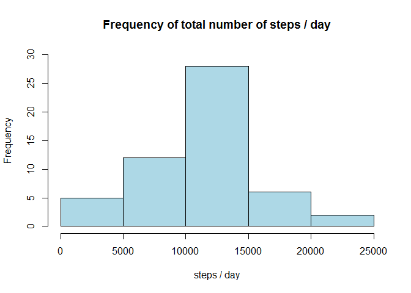
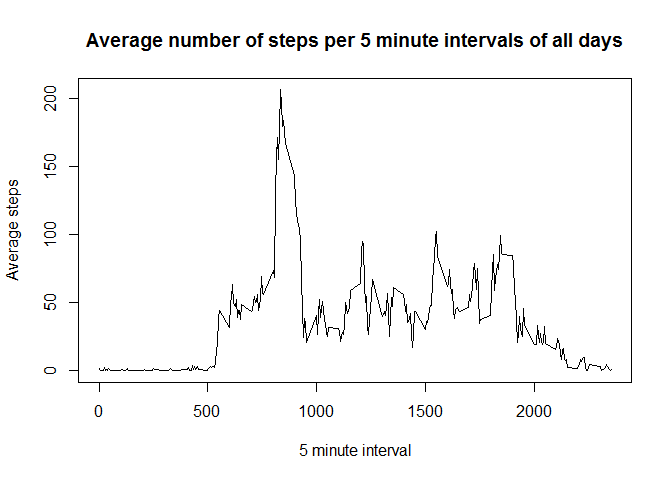
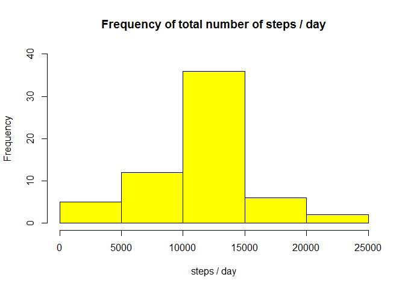
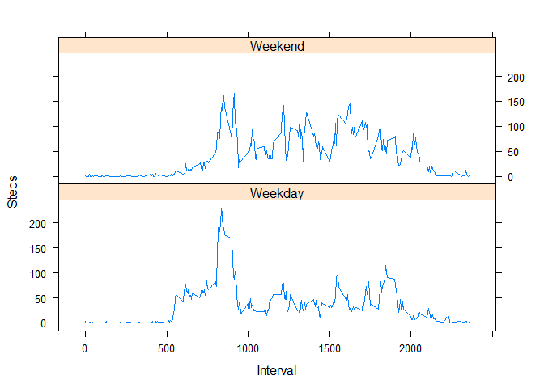

# Reproducible Research: Peer Assessment 1


## Loading and preprocessing the data

No preprocessing done since intial analysis with NAs. Otherwise data suitable for analysis.

```r
activity <- read.csv("./activity.csv", header=TRUE)
```


## What is mean total number of steps taken per day?

Summation of steps per day.

```r
stepday <- aggregate(steps ~ date, data = activity, sum)
```

Histogram of steps per day summation.

```r
hist(stepday$steps, main = "Frequency of total number of steps / day", 
     xlab = "steps / day", col = "lightblue", ylim = c(0,30))
```

 

Mean and median steps per day.

```r
meansteps <- mean(stepday$steps)
mediansteps <- median(stepday$steps)
meansteps
```

```
## [1] 10766.19
```

```r
mediansteps
```

```
## [1] 10765
```


## What is the average daily activity pattern?

Mean steps per interval of day.

```r
stepinterval <- aggregate(steps ~ interval, activity, mean)
```

Time series plot.

```r
plot(stepinterval$interval,stepinterval$steps, type="l"
     , ylab="Average steps",  xlab="5 minute interval"
    , main="Average number of steps per 5 minute intervals of all days")
```

 


The 5-minute interval containing the maximum number of steps.

```r
maxinterval <- stepinterval[which.max(stepinterval$steps),1]
maxinterval
```

```
## [1] 835
```

## Imputing missing values
The number of missing values.

```r
navalue <- sum(!complete.cases(activity))
navalue
```

```
## [1] 2304
```


Strategy for filling in all of the missing values in the dataset.
For each NA value I will use the mean of the interval to replace NA.

```r
activity.na.sub <- transform(activity, steps = ifelse(is.na(activity$steps)
                , stepinterval$steps[match(activity$interval, stepinterval$interval)]
                , activity$steps))
```


Summation steps per day with NA subsituted with average of interval.

```r
stepday.sub <- aggregate(steps ~ date, data = activity.na.sub, sum)

hist(stepday.sub$steps, main = "Frequency of total number of steps / day", 
     xlab = "steps / day", col = "yellow", ylim = c(0,40))
```

 

```r
meansteps.sub <- mean(stepday.sub$steps)
mediansteps.sub <- median(stepday.sub$steps)
meansteps.sub
```

```
## [1] 10766.19
```

```r
mediansteps.sub
```

```
## [1] 10766.19
```

Results of replacing NA: The frequency of the total number of steps increased. The mean remained the same since we used the mean to replace the NAs.  The median changed to the mean because the 
subsitution of NA with the mean changed the mean to the most common value.


## Are there differences in activity patterns between weekdays and weekends?

Add weekend/day factor column to data set. 

```r
activity.na.sub$wk <- as.factor(ifelse(is.element(weekdays(as.Date(activity.na.sub$date)),
                        c("Saturday", "Sunday")), "Weekend" , "Weekday"))
```


Make a panel plot containing a time series plot


```r
stepday.wk <- aggregate(steps ~ interval + wk, data = activity.na.sub, mean)

library(lattice)

xyplot(stepday.wk$steps ~ stepday.wk$interval|stepday.wk$wk
       , main="",xlab="Interval", ylab="Steps"
       ,layout=c(1,2), type="l")
```

 

Results of comparison of weekday to weekend: Weekday steps were much higher in the early 5 minute intervals suggesting exercise prior to work; they were low during work hour intervals and increased slightly in the evening intervals.  Weekend intervals remained active during day time with less variablity then weekdays, which suggested the greater freedom of time during the weekend. 
